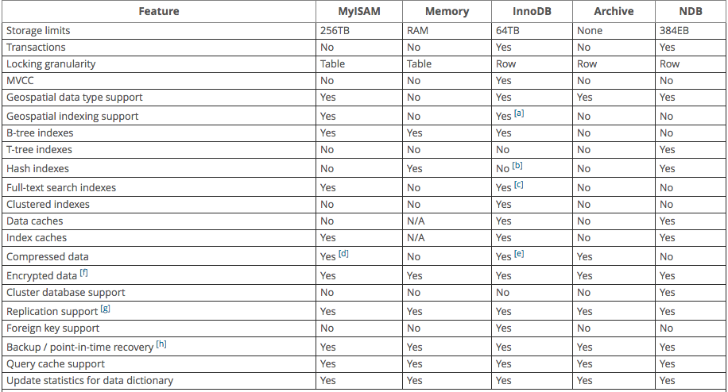

- [Database 종류와 분석(1) - RDBMS란?](https://gingeraebi.github.io/%EA%B0%9C%EB%B0%9C/db/%EA%B3%B5%EB%B6%80/%EC%84%9C%EB%B2%84/2016/11/03/Database%EC%9D%98-%EC%A2%85%EB%A5%98%EC%99%80-%EC%9E%A5%EB%8B%A8%EC%A0%90.html)

## RDBMS 의 종류

이 전 포스트에서 말했듯이 RDBMS란 데이터를 '관계'를 가질 수 있게 설계한 데이터베이스입니다.  
이번 포스트 에서는 이 RDBMS의 종류에는 어떤게 있는지, 어떤 특징이 있는지에 대해 알아보겠습니다.

### 1. MySQL

가장 대표적으로 많이 사용되고 필자도 가장 많이 애용한 데이터베이스입니다. 간단한 유저가 많지 않은 프로그램의 데이터베이스로는 가장 무난히 쓸 수 있고 성능도 어느정도 잘 받쳐주는 서버라고 생각됩니다. 데이터를 넣고 빼는 것에 대한 안정성이 보장되고, 복잡한 조인이나 쿼리도 무난하게 잘 돌아갑니다. (하지만 테이블이 커진고 데이터가 많아진다면...)

그리고 가장 좋은 특징은 일반적인 경우에는 __무료__ 라는 점입니다. (무료는 강조해줘야해!)  
돈 없이 개발하는 가난한 개발자와 학생들에게는 공부, 취미로 코딩하기에 매우 좋은 데이터베이스라 할 수 있죠.  
그래서인지 처음 데이터베이스를 배울때는 대부분 MySQL을 가지고 공부를 하곤 합니다. (저 또한 그랬었죠)

제 경험적인 얘기는 여기까지 하고 이제 긁어모은 자료들을 한번 풀어놔보도록 하겠습니다.

#### MySQL?

일단 구글에 MySQL의 특징이라고 검색하면 가장 먼저 나오는 포스팅에서 특징들을 가져와 보도록 하겠습니다. 해당 포스팅은 2011년에 작성된 포스팅 (현 시점에서 5년전...) 이기 때문에 현재는 다른 상황일 수도 있으리란 점 미리 말씀드리겠습니다.

원문보기 : [반드시 알아야할 MySQL 특징 세 가지](http://gywn.net/2011/12/mysql-three-features/)

#### 특징 1. ~~단일 코어~~에서 Nested Loop Join처리

MySQL에서는 모든 SQL 처리를 ~~단일 코어에서~~(MySQL 5.5.X부터는 멀티코어 CPU에 대한 확장성이 향상되었다고 합니다.) **Nested Loop Join 방식**으로만 처리한다고 합니다.

*참고 : [MySQL 5.5의 새로워진 것들](https://www.linux.co.kr/home2/board/subbs/board.php?bo_table=lecture&wr_id=1759)*

**Nested Loop Join방식이란?**

MySQL에서 한 db에 A와 B테이블이 있다고 생각해봅시다. 이 때 A테이블과 B테이블에서 결과를 가져오려 합니다.  
예를 들어 유저테이블 (A테이블)에서 유저의 이름을 가져오고 쿠폰테이블 (B테이블)에서 유저에게 할당된 쿠폰 이름을 가져오고 싶다고 해보겠습니다.  
이 때 아래와 같은 쿼리를 통해서 우리는 데이터를 가져오게 됩니다.  

	SELECT user.userName, coupon.couponName   
	FROM User user, Coupon coupon  
	WHERE user.userId = coupon.userId

간단히 설명해보자면 User 테이블의 userId와 Coupon 테이블의 userId가 같은곳에서 각각의 이름을 가져와 보여주는 쿼리입니다.

이럴 때, Nested Loop Join방식을 통해 데이터를 읽어오게 되는데 이는 프로그래밍 문법에서 2중 반복문을 사용하는 것과 같은 방식입니다.  
예를 들면 이런 식으로 말이죠. (자바 문법입니다.)

	for (User user : users) {
	    for(Coupon coupon : coupons) {
	        if(user.userId === coupon.userId) {
	            System.out.println(user.userName + coupon.couponName);
	        }
	    }
	}

위 글에는 Nested Join Loop에 대한 설명이 조금은 부족한거 같아서 다른 글 또한 찾아보았습니다.

**Nest Loop Join 방식의 특징**

1. 순차적이다.
2. 부분범위 처리가 가능하다.
3. 종속적이다. 드라이빙 테이블의 처리범위에 따라 처리량 및 속도가 결정된다.
4. Random access 위주, single block , random i/o가 많이 일어난다.
5. 연결고리 상태에 민감하다.
inner table 검색시에는 인덱스를 사용하므로 inner 테이블의 인덱스 효율이 좋아야 한다.
6. 좁은 범위처리에 유리하다. (쿼리 수행결과가 전체 row의 15% 이내일 경우 유리)
7. 인덱스의 효율이 좋다면 가장 최적의 성능을 발휘하는 조인기법이다.
8. 드라이빙테이블이 아닌 테이블의 조건이 없어도 일의 량에 별로 영향을 주지 않으므로 NL loop가 유리하다.
예) 주문처리

아직 초보적인 수준의 개발자라 각각의 의미를 완전히 파악은 못 했지만, 여기서 주목해 봐야 할 것은 좁은 범위처리에 유리, 인덱스의 효율, 연결고리 상태 이정도의 키워드가 아닐까 합니다.  
더 깊게는 이 글에서는 다루지 않겠지만, 궁금하신분들은 찾아보는 것도 좋으리라 생각됩니다.

참고한 블로그

- http://wjkim-info.tistory.com/793  
- http://egloos.zum.com/jjekr/v/3129366

#### 특징 2. 다양한 스토리지 엔진
MySQL에서는 다양한 스토리지 엔진을 지원합니.  
아래는 각각의 특징에 대해 정리 해둔 표입니다.  

이와같이 다양한 스토리지 엔진을 제공해 줌으로써 상황에 따라 맞는 엔진을 선택하여 작업할 수 있습니다.

각 엔진의 특징을 표로 정리해보겠습니다.

| 엔진명  | 엔진 설명                                                                                                                                                                                                                                                                                                                                                                                                 |
|---------|-----------------------------------------------------------------------------------------------------------------------------------------------------------------------------------------------------------------------------------------------------------------------------------------------------------------------------------------------------------------------------------------------------------|
| InnoDB  | Mysql 5.5버젼 이상에서 기본으로 설정되어 있는 엔진입니다. 트랜잭션의 안정성을 보장하고, 외래키를 통한 참조 무결성을 제공합니다.  커밋과 롤백, 충돌 복구를 지원하여 프로젝트 데이터를 보호할 수 있습니다. 또한 저레벨의 locking을 지원합니다. 여러명의 유저가 사용하는 환경에서  nonlocking read를 지원하기 때문에 성능보장이 가능합니다. 기본키에 의존하는 I/O쿼리를 clustered indexes를 통해 줄여줍니다. |
| MyISAM  | non transacional 테이블을 관리합니다. 빠른속도의 저장공간과 검색을 지원합니다. full text 검색을 지원합니다.                                                                                                                                                                                                                                                                                               |
| Memory  | 보통은 Heap이라 불리우는 In-memory 테이블을 제공합니다. 디스크보다 빠른 속도를 위해 RAM에 모든 데이터를 저장합니다.                                                                                                                                                                                                                                                                                       |

이 외의 스토리지 엔진은 아래를 참고하세요.  
참고 : http://www.w3resource.com/mysql/mysql-storage-engines.php

### 마무리

이정도에서 Mysql의 특징에 대한 포스트는 마무리 하도록 하겠습니다.  
정리해보자면 Mysql은 다양한 스토리지 엔진을 제공하는 NL Join방식을 이용하는 데이터베이스라고 생각하면 될 것 같습니다.  

일반적인 웹 서비스에 사용하기 적합할 것으로 보입니다.

다음 포스팅에서는 또 다른 RDBMS인 MSSQL의 특징에 대해서 알아보도록 하겠습니다.
